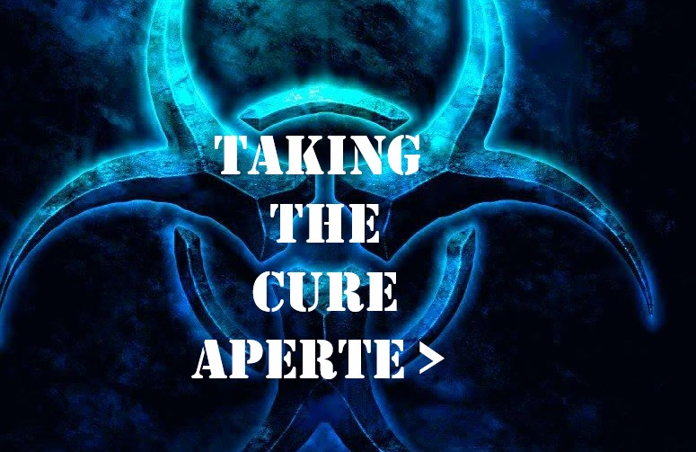
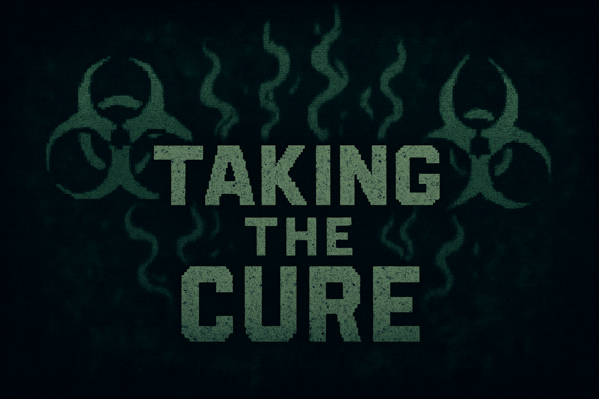
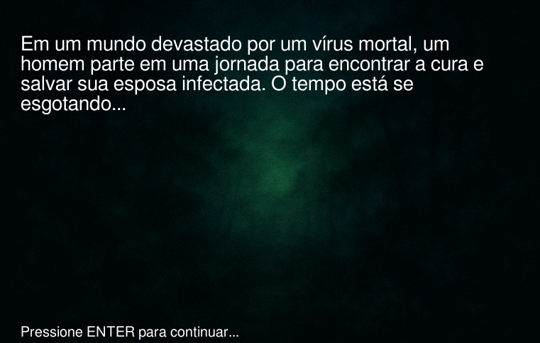

# 🧪 A CURA — Jogo em Python com Pygame

Este projeto foi desenvolvido como parte de uma atividade da disciplina de **Python** do **primeiro período** do curso de **Sistemas para Internet**.  
A proposta consistia em criar um jogo e apresenta-lo no final do periodo, visando o aprendizado e estimulando os alunos a um aprendizado não só na sala de aula.
unico requisito estabelecido foi usar a linguagem python.

---

## 🎮 Sobre o Jogo

**"A Cura"** é um jogo em 2D com visão *top-down*, onde o jogador assume o papel de um homem em busca da cura para sua esposa, infectada por um vírus mortal.  
Durante sua jornada, o personagem precisa:

- Desviar de zumbis que patrulham o cenário.
- Trocar de telas à medida que avança.
- Evitar perder toda sua vida em colisões.
- Ao alcançar a esposa, é exibida uma tela final com a conclusão da história.

---

## 🛠️ Tecnologias e Bibliotecas Utilizadas

- **Linguagem:** Python 3
- **Biblioteca gráfica:**  [Pygame](https://www.pygame.org/)


### 🎬 Tela Inicial

<div align="center">
    <h1>Antes</h1>
    
    <h1>Depois</h1>
    
</div>

### 🧟‍♂️ Telas do Jogo

<div align="center">
    <h1>Antes Historia</h1>
    
    
    <h1>Depois</h1>
    
    <h1>Antes Final</h1>
    

</div>

## 💻 Requisitos para Rodar Localmente

Certifique-se de ter instalado:

- Python 3.8 ou superior
- Biblioteca Pygame


## 🚀 Como Clonar e Rodar o Projeto

```bash
git clone https://github.com/andersonsouza12/jogopython.git

```
Navegue até a pasta do projeto:
```bash
cd nome-da-pasta
```
Para instalar o Pygame, execute:

```bash
pip install pygame

```
Para rodar local, execute no terminal:

```bash

python3 jogo.py

